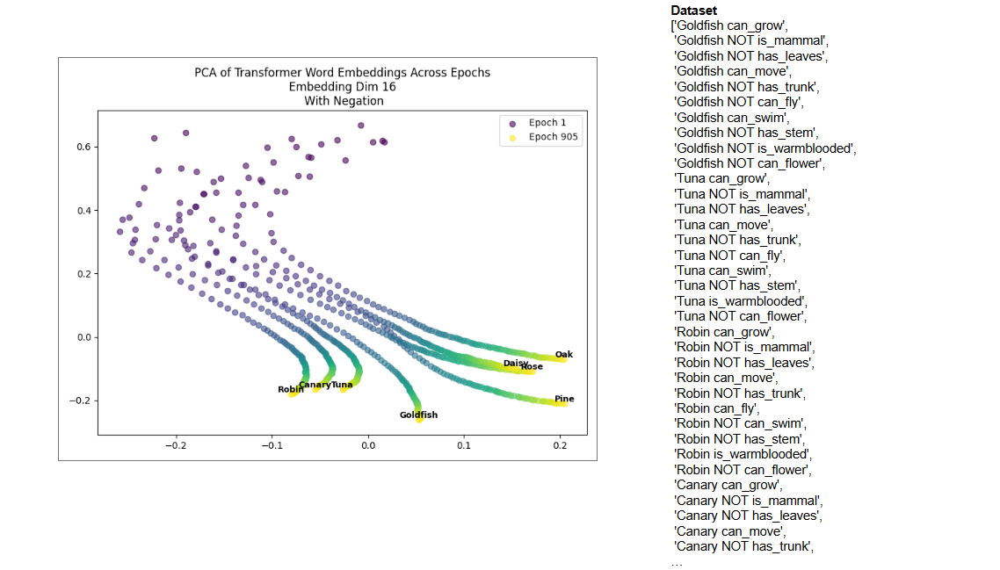

# Semantic Experiments

This repository explores and extends the ideas from the paper [A mathematical theory of semantic development in deep neural networks](https://www.pnas.org/doi/10.1073/pnas.1820226116) by Andrew Saxe et al. Specifically, this project investigates how semantic representations emerge in neural networks under modified training regimes and architectures.

## Overview

The original paper presents a mathematical analysis of how deep linear networks develop semantic structure when trained on one-hot input-output mappings. This repository builds on those insights with two main experimental directions:

### 1. Logical Operations in Training Data

Instead of only training on one-hot output features, we introduce logical operations (AND, OR, etc.) between output features. In this setup, the inputs are a sum of one-hots that each represent an entity from the original data distribution and the outputs are computed based on a applying a give logical operation (AND, OR, NOT, XOR) to the features of the entities being combined. This modification allows us to observe the effects of richer semantic relationships in the training data and how they influence learning trajectories and final representations.

### 2. Transformer-based Architecture with Token Inputs

We replace the original linear multi-layer perceptron (MLP) with a simple GPT-like transformer model. Additionally, we substitute one-hot inputs with tokenized representations, leveraging the transformer’s ability to handle sequences and contextual embeddings. This experiment aims to bridge the gap between the analytical results in linear models and the empirical behavior of modern neural architectures.

## Structure

- `experiments/` — Scripts and notebooks for running logical operation experiments.
- `models/` — Implementation of linear MLPs and transformer architectures.
- `data/` — Generation and handling of input/output mappings, including logical operations.
- `analysis/` — Tools and scripts for analyzing results, visualizing learning trajectories, and measuring semantic structure.
- `README.md` — This file.

## Getting Started

1. Clone the repository:
   ```bash
   git clone https://github.com/amoldwin/semantic-experiments.git
   ```
2. Install requirements:
   ```
   pip install transformers
   pip install pandas
   pip install torch
   pip install matplotlib
   pip install numpy
   pip install scikit-learn
   ```
3. Run experiments:
   - For linear MLP with logical outputs:  
     See `Experiments_logic_AND.ipynb`, `Experiments_logic_OR.ipynb`, `Experiments_logic_XOR.ipynb`
   - For transformer with token inputs:  
     See `train_tiny_model.py`

Here is one example showing the representational dynamics using the transformer and also augmenting the training dataset with the NOT operation: 

## Reference

- Saxe, A. M., McClelland, J. L., & Ganguli, S. (2019). [A mathematical theory of semantic development in deep neural networks](https://www.nature.com/articles/s41467-019-10320-7). *Nature Communications*, 10, 1-19.

## Contributing

Contributions are welcome! Please open issues or submit pull requests for improvements, suggestions, or new experiments.

